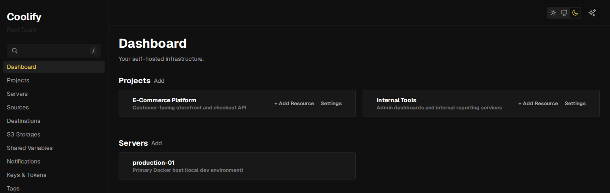

# 🚀 Coolify-Full (Enhanced Fork) — Senior Full-Stack Engineering Demonstration

[](https://github.com/Terrence721/coolify-full/actions/workflows/quality.yml)
[](https://github.com/Terrence721/coolify-full/actions/workflows/codeql.yml)

<!-- markdownlint-disable-next-line MD036 -->
**Last Updated: July 23, 2026**

This repository is a professionally enhanced fork of [Coolify](https://coolify.io), created to demonstrate senior full-stack engineering capabilities across frontend modernization, backend engineering, and containerized infrastructure.

**Evaluating this for a specific role?** See [`POSITION_ALIGNMENT.md`](POSITION_ALIGNMENT.md) for a direct, requirement-by-requirement mapping between this repo and a real job description — not a generic "skills" list, an actual line-by-line comparison.



It showcases real-world engineering work including:

- Migrating a legacy Laravel Livewire UI to Inertia.js + React, page by page — **complete** as of 2026-07-14, every phase documented and verified
- A sustained static-analysis hardening pass: PHPStan's suppressed-error baseline taken from 1,306 down to 60 across 65 phases, each verified with a full test-suite run — the remaining 60 are individually confirmed analysis-tool limitations (documented in `todo.md`), not unaddressed work
- Security-specific static analysis beyond type-safety — CodeQL for the React frontend, Psalm taint analysis for the PHP backend, added as part of this hardening pass, catching 11 real CVE advisories and 2 real findings in the process (see `todo.md`)
- Removing the commercial/billing surface area to produce a clean, self-hosted-only fork
- Working inside — and being honest about the constraints of — a large, real-world Laravel monolith rather than a greenfield rewrite
- Linux-native engineering throughout: every process (PHP, Node, Docker, Postgres, Redis) runs in **Ubuntu Linux** — the Windows machine is only the host (WSL2)

This project is not affiliated with the Coolify team and is intended solely as a technical portfolio artifact.

**At a glance:** 84/84 Livewire pages converted to React · PHPStan baseline 1,306 → 60 (65 phases) · 1,246 Pest tests passing (5,114 assertions) · 263 Vitest/Testing Library React component tests (28 suites) · zero known regressions — every number here is reproducible from this repo's own commit history, not a claim to take on faith.

**Reading the commit history:** 404 commits total — 64 are PHPStan hardening phases, 108 touch only documentation/tracking files (`todo.md`, `README.md`, `docs/*.md`), 2 are empty merge commits (identical branches, no unique diff), and the remaining 230 are other engineering work (features, bug fixes, the React migration). `git log --oneline | grep -E "^[a-f0-9]+ Phase [0-9]+ —"` isolates just the PHPStan phases if you want to skip straight to that thread (plain `git log --grep=`, unlike this, also matches "Phase N" mentions inside unrelated commit bodies — worth knowing if you go digging further yourself). `todo.md`'s "PHPStan baseline reductions" section has a per-phase summary table (baseline delta, focus, highlight) plus a "PHPStan baseline milestones" table for the phases that found a real bug or a structural fix, including one phase (59) that landed folded into an emergency CI-fix commit (`3894266f4`) rather than its own "Phase 59 —" commit.

---

## 🧭 Why This Project Matters

Rewriting a UI from scratch is easy when there's no existing app to keep working. This project demonstrates the harder, more common real-world task: modernizing a live, actively-used Laravel application's frontend **without a big-bang rewrite** — converting one page at a time, verifying each conversion automatically, and keeping a running audit trail a reviewer can actually check.

**Incremental modernization, not a rewrite**  
The original Coolify UI was built on Blade, Livewire, and Alpine.js. Rather than discarding that and building a separate SPA, this fork adopted **Inertia.js**: pages became React components rendered through the same Laravel routes, migrated incrementally rather than in one big-bang rewrite. As of 2026-07-14 the migration is complete — every full-page route and all navigation/chrome infrastructure is React, and `livewire/livewire`/Alpine.js have both been removed from the app entirely. See [`docs/livewire-to-react-migration.md`](docs/livewire-to-react-migration.md) for the full, phase-by-phase log (page inventory, conversion recipes, what was verified and how).

**Why Inertia over a decoupled SPA + API**  
A plain React SPA would require designing and versioning a whole new API surface before a single page could move. Inertia avoids that: each migrated page stays a normal Laravel route/controller returning props, so migrated and not-yet-migrated pages coexist under the same app, and Laravel's existing routing, auth, CSRF, and session handling keep working unchanged.

**De-commercialization**  
This fork also strips the SaaS/billing surface area from upstream Coolify (Stripe integration, subscription gating, sponsor/upsell UI) to produce a clean, no-frills, self-hosted-only platform. See [`todo.md`](todo.md) for what's been removed and what's still tracked.

**Full-stack engineering depth**  
This project demonstrates hands-on experience across:

- Frontend modernization (Livewire → Inertia.js/React, now complete)
- Backend refactoring (Laravel controllers, policies, validation)
- Containerized development environments (Docker Compose, multiple coordinated services)
- Test-driven verification: Pest 4 feature tests written alongside every converted page (backend), Vitest + React Testing Library for frontend component behavior (see `todo.md`'s "Frontend component testing" section)
- Documentation and architectural communication as a first-class deliverable, not an afterthought

---

## 🖥 Development Environment (Linux via WSL2)

This project is developed on **Windows 11 using WSL2 (Ubuntu)** — not native Windows.

All PHP, Node, Composer, Docker, and Laravel processes run inside the Linux subsystem to ensure production-accurate behavior:

- Matches real Linux servers (PHP-FPM, Nginx, Redis, PostgreSQL)
- Avoids Windows filesystem performance issues and slow bind mounts
- Ensures Docker behaves like production (WSL2 backend)
- Keeps Laravel’s file watchers, Vite HMR, and queue workers responsive
- Prevents Windows-specific PHP extension and path inconsistencies

The repository **must** be cloned into the WSL filesystem (e.g. `~/projects/coolify-full`), not under `C:\...`, to avoid 5–10× slower I/O and degraded Docker/Vite performance. See `DEVELOPING_IN_CONTAINERS_WINDOWS.md` and `docs/command.md`’s “WSL2 migration” section for details.

**Reviewing from native Linux (or macOS)?** Nothing in this repo is Windows-specific. The entire toolchain — bash, Docker Compose, Composer, Artisan, Vite — is Linux-native and runs identically on any Linux machine: clone, `cp .env.development.example .env`, `docker compose -f docker-compose.yml -f docker-compose.dev.yml up -d`, done. The WSL2 notes exist only because the host hardware happens to run Windows; the development experience is Ubuntu all the way down.

---

## 🧩 What Coolify Is (Summary)

Coolify is an open-source, self-hostable PaaS — an alternative to Heroku/Netlify/Vercel that manages servers, applications, databases, and services over SSH. This fork strips that down to a no-frills self-hosted tool: the entire Stripe/subscription billing subsystem is gone (no `subscriptions` table, no payment-gated features, no sponsor/upsell UI, no server-count caps tied to a paid tier), leaving the deployment/server-management core with nothing else to configure or pay for.

---

## 🏗 Architecture Overview

This is a **single Laravel application**, not a decoupled frontend/backend split. There is no standalone React app and no separate API server — React pages render through the same Laravel routes as everything else, via Inertia.js.

```text
┌───────────────────────────────────────────────┐
│                 Laravel app                   │  (nginx + PHP-FPM, one container)
│   Inertia/React pages (94 .jsx pages) — all   │  ← migration complete,
│   full-page routes, same Laravel routes/auth  │     no Livewire remains
│   Horizon queue workers (deploys, backups)    │
└──────┬──────────┬─────────────┬───────────────┘
       ▼          ▼             ▼
   Postgres    Redis      coolify-realtime
  (database) (cache +    (Soketi WebSockets for live
              queues)     status + Node terminal-server
                          for SSH terminals)

  Dev-only:  Vite (HMR, never browsed directly) · Mailpit (mail capture)
             MinIO (S3 for backup tests) · testing-host (fake managed server)
```

---

## 📋 Project Tracking

Work on this fork is tracked two ways:

- **[`todo.md`](todo.md)** — the primary, detailed record: a phase-by-phase written log of everything done and everything still open, with dates, verified deltas, and the reasoning behind each decision. This is the source of truth.
- **[GitHub Project board](https://github.com/users/Terrence721/projects/1)** — a Scrum-style Backlog/Planned/In Progress/Verification & QA/Done view of the same work, for a quick at-a-glance status without reading the full log. Kept in sync with `todo.md`.
